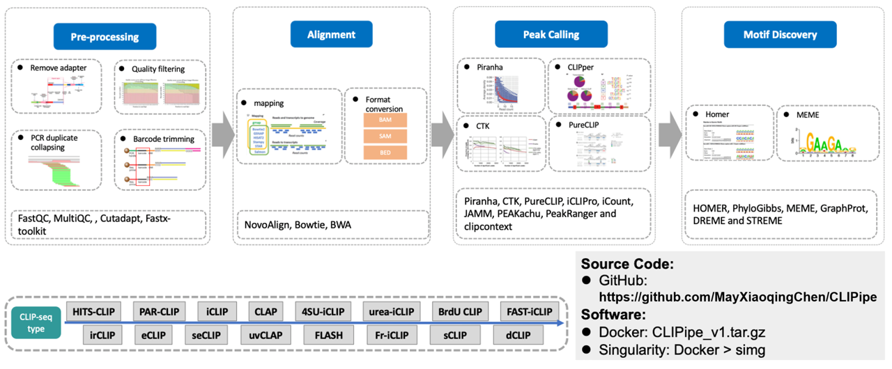

# CLIPipe

## Table of Contents:

-   [Requirements](docs/1_requirement.md)
-   [Installation](docs/2_installation.md)
-   [Basic Usage](docs/3_basic_usage.md)
-   [Usage](docs/4_usage.md)
    -   [Pre-processing](docs/4_usage.md#pre-processing)
    -   [Alignment](docs/4_usage.md#alignment)
    -   [Peak calling](docs/4_usage.md#peak-calling)
    -   [Motif discovery](docs/4_usage.md#motif-discovery)
-   [Frequently asked questions](docs/5_faq.md)
-   [Copyright and License](docs/6_copyright_and_license.md)
-   [Tutorial](https://clipipe.readthedocs.io/)

This documentation is for CLIPipe version: 1.0.3

## Introduction
CLIPipe is an integrated pipeline for analyzing CLIP sequencing data. It provides all the commands needed to process CLIP-seq data, and it could identify sites of protein-RNA interactions on RNA from CLIP-seq data.

CLIPipe's input is the raw FASTQ file of CLIP-seq, and its main output is BED files with identified cross-linked sites.

Several other analyses are also included in CLIPipe that provide insights into the properties of protein-RNA interaction.

The CLIPipe workflow consists of:

-   Pre-processing function:
    -   Quality control, adapter removal, low-quality reads filtering, duplicates collapsing, and barcode removal of the raw CLIP-seq data.
-   Alignment function:
    -   Mapping pre-processed data to reference genome using bowtie, bwa, and novoalign
-   Peak calling function:
    -   Binding peak enrichment using Piranha, CTK, PureCLIP, iCLIPro, iCount, JAMM, PeakRanger, and clipcontext
-   Motif discovery function:
    -   Motif discovery of the binding regions using HOMER, PhyloGibbs, MEME, GraphProt, DREME and STREME
